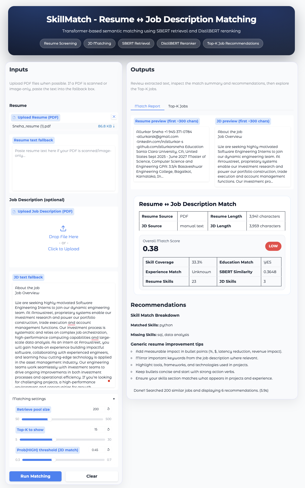
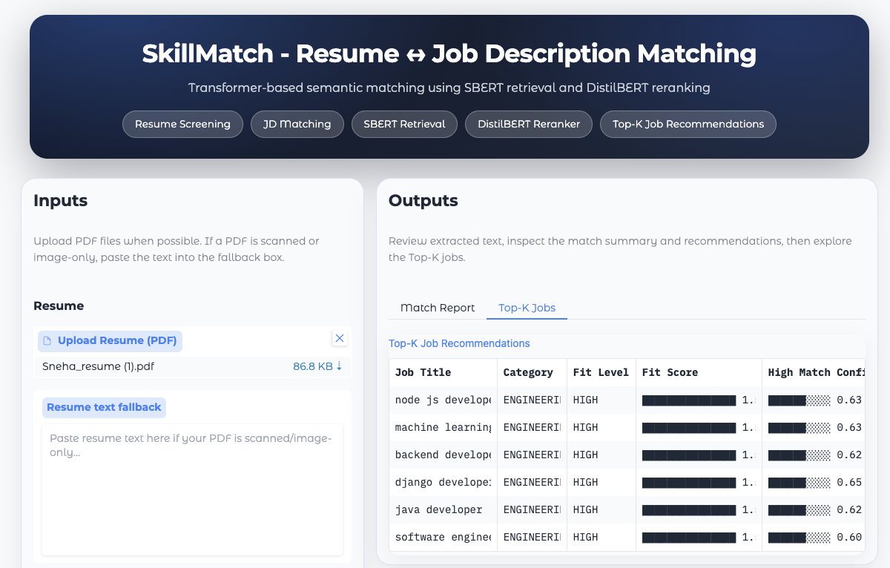

# SkillMatch - Resume ↔ Job Description Matching System

SkillMatch is a transformer-based system that evaluates how well a resume matches a job description and recommends relevant jobs.

The system combines **semantic retrieval using SBERT** and **machine-learning reranking using DistilBERT** to produce **Top-K job recommendations** from a job dataset.

---

## Key Features

- Resume ↔ Job Description match scoring  
- Skill extraction from resume and job description  
- Education and experience heuristic matching  
- Semantic similarity using **SBERT embeddings**  
- **DistilBERT classifier** for job fit prediction  
- **Top-K job recommendation system**  
- Interactive **Gradio web interface**

---

## System Architecture

The pipeline follows these steps:

1. Resume text extraction (PDF or manual text)
2. Skill, education, and experience detection
3. Semantic retrieval using **Sentence-BERT**
4. Job candidate retrieval and ranking
5. **DistilBERT reranking** for job-fit prediction
6. Top-K job recommendations

---

## Tech Stack

- Python
- PyTorch
- Sentence Transformers (SBERT)
- DistilBERT
- Gradio
- Pandas
- NumPy
- Scikit-learn

---

## Installation

Clone the repository:

```bash
git clone https://github.com/allurkarsneha/SkillMatch-Resume-Job-matching-system.git
cd SkillMatch-Resume-Job-matching-system
```

Install the required Python dependencies:

```bash
pip install -r requirements.txt
```

---

## Running the Project

Open the notebook:

```bash
notebooks/SkillMatch.ipynb
```

Run all the cells in the notebook.  
The final cell launches the **Gradio interface**, where you can:

- Upload a resume (PDF or paste text)
- Upload or paste a job description
- View resume ↔ job description match analysis
- Explore Top-K job recommendations

---

## Example Interface

### Resume ↔ Job Description Match Report



### Top-K Job Recommendations


